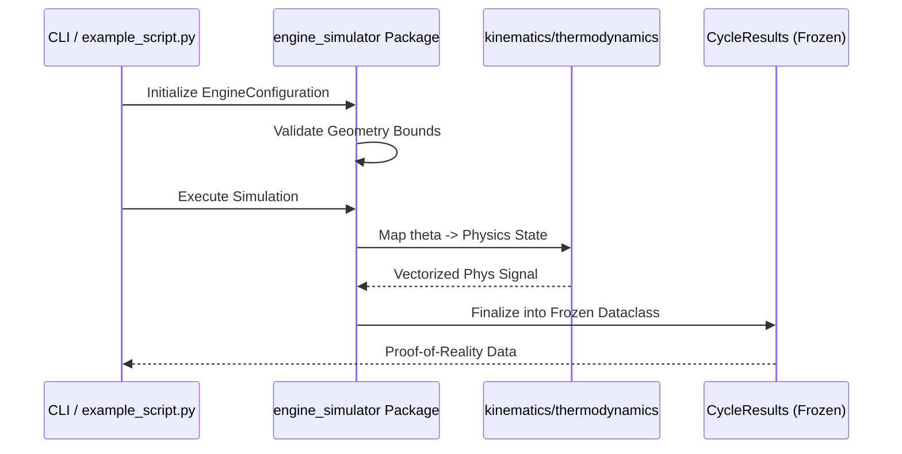

# System Architecture Documentation

## 1. Architectural Philosophy

The Engine Simulation Framework is designed as a **procedural, synchronous, and deterministic** system. It prioritizes mathematical transparency and numerical stability over concurrency.

## 2. Package Structure: `engine_simulator`

The core logic is isolated within a single package to maximize durability and prevent namespace pollution.

### `engine_config.py` (The Contract)
- **Role**: Defines the physical constraints of the engine.
- **Enforcement**: Validates inputs (Bore, Stroke, Rod Length) to ensure they form a valid geometric volume. Prevents $CR < 1$ or negative displacement configurations.

### `kinematics.py` (Geometric Solvers)
- **Role**: Pure analytical functions for slider-crank geometry.
- **Abstraction**: `SliderCrank` class provides exact solutions for position, velocity, and acceleration without reliance on simplified harmonics.

### `thermodynamics.py` (Physical Invariants)
- **Role**: Enforces the First Law of Thermodynamics across the cycle.
- **Mechanism**: Integrates $dU = dQ - dW$ using variable specific heats $\gamma(T)$.

### `simulation/` (Orchestration)
- **SingleCylinderSimulator**: Iteratively integrates the cycle over $720^\circ$.
- **MultiCylinderSimulator**: Maps the reference cylinder onto an arbitrary firing order using vectorized NumPy arithmetic.

## 3. Data Flow Model

## 4. Strict Guarantees

1.  **Immutability**: Once a simulation result is produced, it is **frozen**. No downstream component can alter the physical history of a cycle.
2.  **Numerical Stability**: The system uses `scipy` root-finding for internal energy inversion, ensuring pressure and temperature remain physically consistent even at high compression ratios.
3.  **Vectorization**: Crank phasing and torque summation are calculated as a single $O(1)$ NumPy operation relative to number of cylinders, ensuring scalability to complex topologies (e.g., V10, V12).

---

*For contribution guidelines and mandatory verification protocols, see [CONTRIBUTING.md](CONTRIBUTING.md).*
